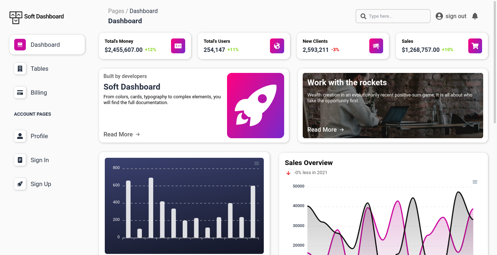

# Soft Dashboard



## ✨ Tecnologias

- [Vite](https://vitejs.dev/)
- [Typescript](https://www.typescriptlang.org/)
- [React](https://reactjs.org/)
- [React Router](https://reactrouter.com/)
- [Axios](https://github.com/axios/axios)
- [React Modal](https://github.com/reactjs/react-modal)
- [React Apexcharts](https://apexcharts.com/)
- [React Icons](https://react-icons.github.io/react-icons/)
- [Styled components](https://styled-components.com/)
- [Faker js](https://github.com/faker-js/faker)
- [Miragejs](miragejs.com/)

## 💻 Projeto

## Como executar

Clone o projeto e acesse sua pasta

```bash
$ git clone https://github.com/wendson13/soft-dashboard.git
cd soft-dashboard
```

Instale as dependências e execute o projeto com yarn ou npm

```bash
# instalar dependências
$ yarn
  ou
$ npm i

# executar o projeto
$ yarn dev
  ou
$ npm run dev
```
acesse o projeto em [localhost:3000](http://localhost:3000) em seu navegador.

## 📌 Layout

layout usado no projeto no link abaixo

- [layout web](https://www.figma.com/community/file/987711789844505789)

## Creditos por images
- [@rarchitecture_melbourne](https://unsplash.com/@rarchitecture_melbourne)
- [@jkakaroto](https://unsplash.com/@jkakaroto)
- [@jupp](https://unsplash.com/@jupp)

## 📝 License

Esse projeto está sob a licença MIT. Veja [LICENSE](LICENSE) para mais detalhes.